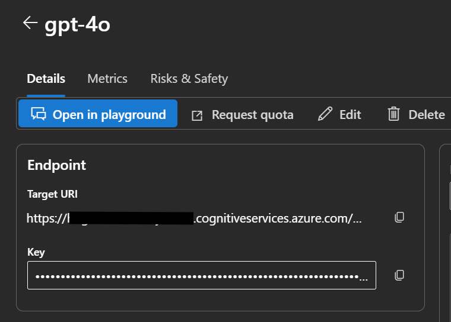

# OpenAI Log Probabilities Explorer

This repository provides Jupyter notebooks for exploring and visualizing log probabilities from OpenAI models deployed through Azure AI Foundry. Log probabilities (logprobs) reveal the model's confidence in its token selections and show alternative tokens that were considered during generation.

## Features

- **Interactive Exploration**: Jupyter notebook with step-by-step examples
- **Visual Output**: Terminal-style color-coded display showing token probabilities
- **Top-K Probabilities**: View the top 5 token alternatives at each position with their probabilities
- **Dev Container Ready**: Pre-configured development environment with all dependencies

## Prerequisites

### Azure AI Foundry Deployment

You'll need an OpenAI model deployed through Azure AI Foundry. Follow the official documentation to set up your deployment:

- **Create Azure AI Foundry Resource**: [Create and manage Azure AI Foundry resources](https://learn.microsoft.com/en-us/azure/ai-services/multi-service-resource)
- **Deploy OpenAI Models**: [Deploy models from the Azure AI Foundry model catalog](https://learn.microsoft.com/en-us/azure/ai-foundry/how-to/deploy-models-openai)

  Supported models include GPT-4, GPT-4o, and GPT-3.5-Turbo with logprobs support.
  
- **Get Deployment Details**: 
  
  You can find your endpoint and key in the Azure AI Foundry portal under your deployment details:
  
  


## Setup

### 1. Choose Your Development Environment

#### Option A: GitHub Codespaces (Easiest)

1. Click the **Code** button on the GitHub repository page
2. Select the **Codespaces** tab
3. Click **Create codespace on main**
4. Wait for the codespace to build (uses the dev container configuration automatically)
5. Once ready, the environment is fully configured with all dependencies

**Benefits:**
- No local setup or cloning required
- Runs entirely in the browser or VS Code
- Same dev container configuration as local development
- Free tier available for GitHub users

#### Option B: Local Dev Container

If using VS Code locally with the Remote - Containers extension:

1. Clone the repository:
   ```bash
   git clone https://github.com/howardginsburg/OpenAILogProbs.git
   cd OpenAILogProbs
   ```
2. Open the repository in VS Code
3. Press `F1` → "Dev Containers: Reopen in Container"
4. Wait for the container to build and configure

**Benefits:**
- Works offline after initial setup
- Full control over local resources

Both options automatically:
- Install Python 3.13 with JupyterLab
- Install required packages (openai, termcolor)
- Configure VS Code extensions for Python and Jupyter

### 2. Configure Environment Variables

Create a `.env` file in the root directory with your Azure AI Foundry deployment credentials:

```env
AOAI_ENDPOINT="https://your-foundry-resource.openai.azure.com"
AOAI_KEY="your-api-key-here"
AOAI_DEPLOYMENT="your-deployment-name"
```

You can find these values in Azure AI Foundry portal under your deployments section.

**Important**: Never commit your `.env` file with real credentials to version control.

## Usage

1. Open the notebook: `aoai_logprobs.ipynb`

2. Run all cells or step through them individually

3. Modify the prompt in the final cell to explore different queries:
   ```python
   prompt = "Your question here?"
   response, token_probs = get_model_response(client, prompt, deployment_name)
   ```

## Understanding the Output

The notebooks display:
- **Token Index**: Position in the generated sequence
- **Selected Token**: The token actually chosen by the model
- **Top 5 Alternatives**: Other tokens the model considered with their probabilities
- **Probabilities**: Shown as percentages (0-100%)

Selected tokens are highlighted/marked with `=`, while alternatives use `:`.

## Attribution

The `aoai_logprobs.ipynb` notebook is based on work by [Yanan Cai](https://github.com/YananCai) and [Scott Hanselman](https://github.com/shanselman).

## Resources

- [GitHub Codespaces Documentation](https://docs.github.com/en/codespaces)
- [Azure AI Foundry Documentation](https://learn.microsoft.com/en-us/azure/ai-foundry/)
- [Deploy OpenAI models in Azure AI Foundry](https://learn.microsoft.com/en-us/azure/ai-foundry/how-to/deploy-models-openai)
- [Azure OpenAI Service Documentation](https://learn.microsoft.com/en-us/azure/ai-services/openai/)
- [Understanding Log Probabilities](https://platform.openai.com/docs/guides/text-generation/log-probabilities)